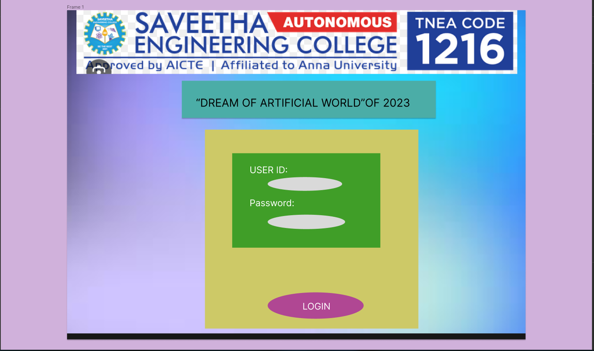
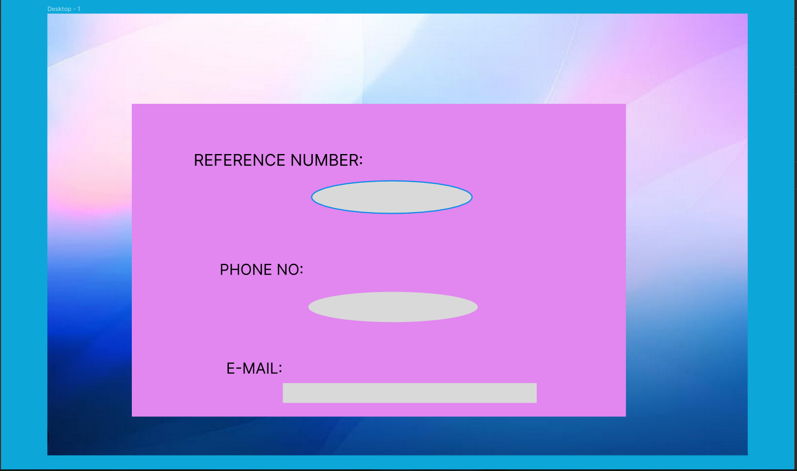
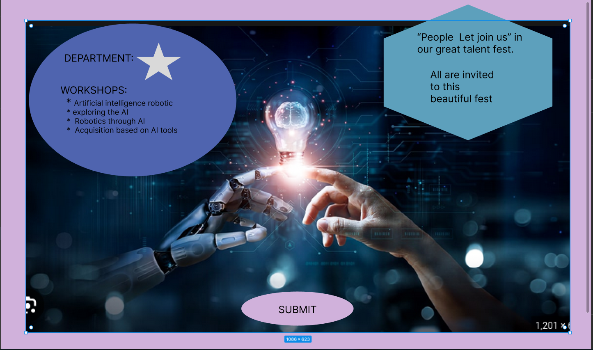

# Event Registration Web Application

## AIM:
To design, develop and deploy a web application for event registration.

## DESIGN STEPS:

### Step 1:
Start the program.

### Step 2:
Create the django environment

### Step 3:
Create the project that names myproj.

### Step 4:
Create the static and index.html.

### Step 5:
Paste the code in the index.html.
### Step 6:

End the code.

### Step 6:

The url is http://localhost:8000/static/html/index.html


## PROGRAM :
```
<!DOCTYPE html>
<html lang="en">

<head>
    <meta charset="UTF-8">
    <title>Dream of Artificial World 2023 Registration</title>
</head>

<body>
    <div id="page1">
        <form action="page2.html" method="post">
            <label for="userID">User ID:</label>
            <input type="text" id="userID" name="userID" required><br><br>
            <label for="password">Password:</label>
            <input type="password" id="password" name="password" required><br><br>
            <input type="submit" value="Login">
        </form>
    </div>
    <div id="page2" style="display: none;">
        <form action="page3.html" method="post">
            <label for="phoneNumber">Phone Number:</label>
            <input type="tel" id="phoneNumber" name="phoneNumber" required><br><br>
            <label for="email">Email:</label>
            <input type="email" id="email" name="email" required><br><br>
            <label for="department">Department:</label>
            <select id="department" name="department">
                <option value="IT">IT</option>
                <option value="Marketing">Marketing</option>
                <option value="Engineering">Engineering</option>
                
            </select><br><br>
            <input type="submit" value="Next">
        </form>
    </div>

    
    <div id="page3" style="display: none;">
        <form action="submission.php" method="post">
            <p>Please select the workshops you're interested in:</p>
            <input type="checkbox" id="workshop1" name="workshop1" value="Workshop 1">
            <label for="workshop1">Workshop 1</label><br>
            <input type="checkbox" id="workshop2" name="workshop2" value="Workshop 2">
            <label for="workshop2">Workshop 2</label><br>
            
            <br>
            <input type="submit" value="Submit">
        </form>
    </div>

    <script>
        
        document.querySelector('#page1 form').addEventListener('submit', function (e) {
            e.preventDefault();
            document.getElementById('page1').style.display = 'none';
            document.getElementById('page2').style.display = 'block';
        });

        document.querySelector('#page2 form').addEventListener('submit', function (e) {
            e.preventDefault();
            document.getElementById('page2').style.display = 'none';
            document.getElementById('page3').style.display = 'block';
        });
    </script>
</body>

</html>
```

## OUTPUT:



## Result:
Thus the program created successfully.
